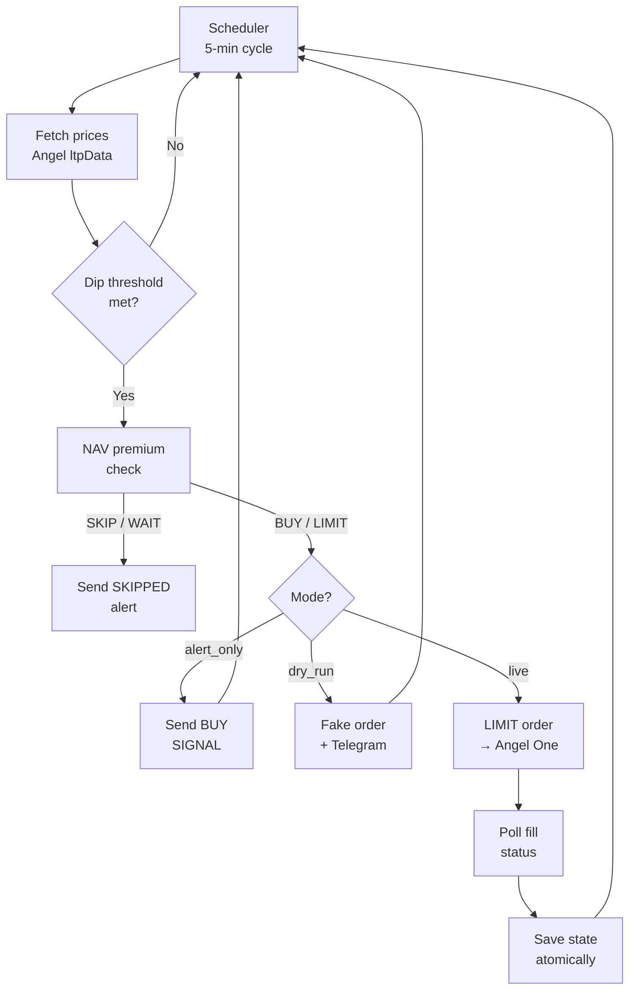
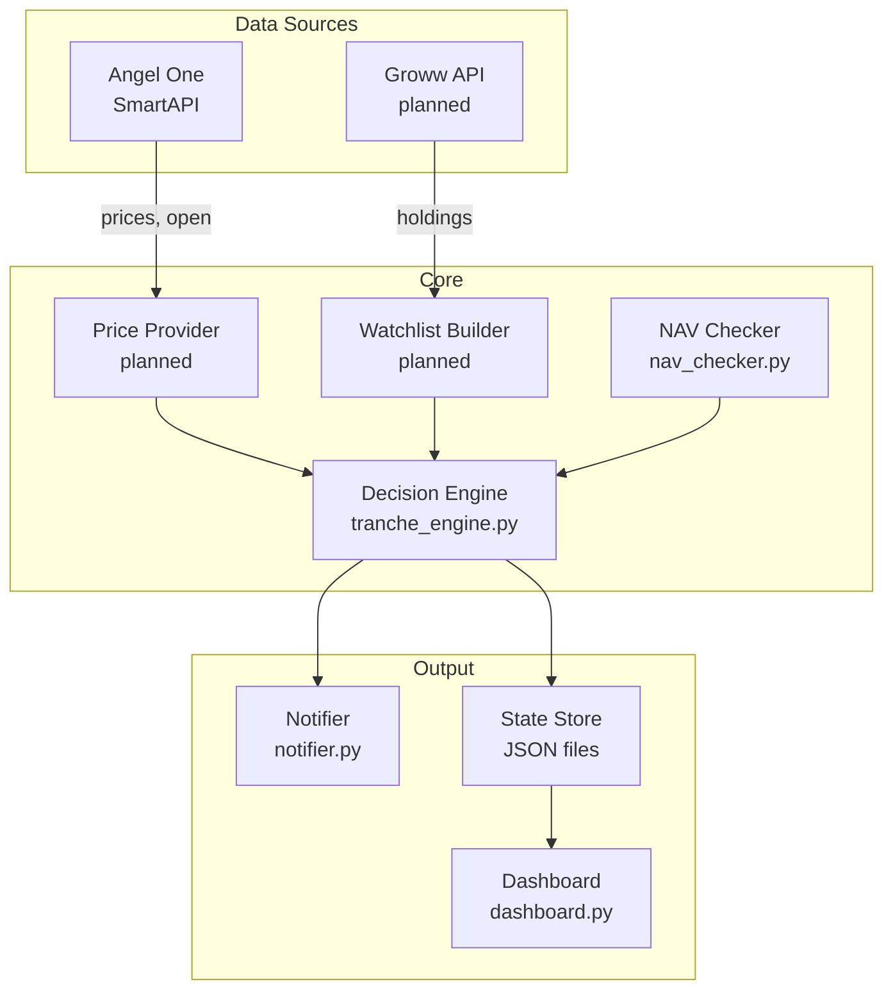

# ETF Trading Bot

[](https://github.com/Akshat2925/quant-system/actions/workflows/tests.yml)
[](https://www.python.org/)
[](LICENSE)
[](CHANGELOG.md)

An automated ETF monitoring and alert system for Indian markets, built on the **Angel One SmartAPI**.

> v3 is under active development. See [ROADMAP.md](ROADMAP.md) for what is coming next.

---

## In 60 seconds

**For recruiters**
A personal finance automation project built in Python. Demonstrates API integration (Angel One SmartAPI), async/background processing, structured logging, atomic file I/O, a full pytest suite with mocked external services, and a modular architecture that separates data fetching, decision logic, alerting, and state management.

**For investors / users**
The bot watches a set of ETFs during NSE market hours. When an ETF's intraday price dips past a configurable threshold it sends a detailed Telegram alert — or, in live mode, places a limit buy order. It tracks a monthly budget, respects a daily spending cap, and verifies the NAV premium before every signal. Everything is configurable; nothing happens without your explicit setup.

**For developers**
FastAPI-style layered design: `connector.py` owns broker I/O, `tranche_engine.py` owns allocation math and state, `notifier.py` owns all Telegram output, and `bot.py` wires them together in a 5-minute polling loop. Three operating modes (`alert_only` / `dry_run` / `live`) share the same code path; the mode tag changes what happens at the buy step. 82 tests, all mocked, no real credentials needed.

---

## The problem and the idea

Most retail investors miss intraday dips because they are busy. By the time they check their phone, the ETF has already recovered.

Think of this bot as a watchful assistant: it keeps an eye on a list of ETFs all day, checks whether a dip looks like a genuine discount (not just noise), and either tells you immediately or acts on your behalf — whichever you prefer. It keeps a notebook of everything it did, and it never spends more than you told it to.

---

## How it works

```
1. WATCH   Every 5 minutes: fetch live price + day-open from Angel One
2. DECIDE  Compare intraday change against each ETF's threshold
3. CHECK   Verify NAV premium (declared NAV from mfapi.in)
4. ALERT   Send a structured Telegram message with suggested action
   or ACT   Place a LIMIT buy order (live mode only, with confirmation)
5. RECORD  Save state atomically; update monthly and daily budgets
```



---

## What it can do today

| Capability | Status |
|---|---|
| Intraday dip detection with configurable thresholds | ✅ Done |
| Three operating modes: alert-only, dry-run, live | ✅ Done |
| Structured Telegram alerts for every event | ✅ Done |
| NAV premium check (advisory and strict) | ✅ Done |
| Budget-aware proportional allocation | ✅ Done |
| Daily spending cap and monthly budget rollover | ✅ Done |
| Per-symbol once-per-day guard (crash-safe) | ✅ Done |
| Atomic state files, corrupt-state detection | ✅ Done |
| Order fill verification (live mode) | ✅ Done |
| Session re-login on token expiry | ✅ Done |
| IST timezone, NSE holiday guard | ✅ Done |
| Streamlit dashboard | ✅ Done |
| Static IP guard (code ready) | 🔄 Not yet integrated |
| Dynamic watchlist from live holdings | ⏳ Stage 5 |
| Groww connector (holdings source) | ⏳ Stage 3 |
| Unified portfolio model with P&L | ⏳ Stage 7 |
| Sell / profit-booking alerts | ⏳ Stage 11 |

---

## Version history

| Version | Problem it solved | What was added |
|---|---|---|
| v1.0.0 | Manual buying missed intraday dips | Single ETF, tranche-based buying at fixed drops |
| v2.0.0 | One ETF is not diversified; fixed tranches waste budget | 5 ETFs, proportional allocation, NAV check, full safety suite |
| v3.0.0-alpha | Watchlist was hardcoded; no portfolio view; no holdings source | Operating mode system, Telegram overhaul, Groww integration (in progress) |

---

## Architecture



| Module | Responsibility |
|---|---|
| `bot.py` | Polling loop, mode resolution, trigger detection, wiring |
| `connector.py` | Angel One API: login, prices, funds, orders |
| `tranche_engine.py` | Allocation math, budget accounting, state persistence |
| `nav_checker.py` | ETF universe definition, NAV premium check |
| `notifier.py` | All Telegram output: formatting, queue, dedupe, retry |
| `ip_guard.py` | Public IP fetch and static IP verification |
| `config.py` | Config loading and validation |
| `dashboard.py` | Streamlit read-only status view |
| `market_detector.py` | Nifty 50 market-wide fall alert |
| `backtest.py` | Offline CSV-based simulation |

---

## Safety by design

- **`alert_only` is the default** — zero order API calls until you explicitly set `MODE=live`
- **Live mode requires confirmation** — type `YES` or pass `--confirm-live`
- **LIMIT orders only** — no MARKET, no IOC (NSE algo rules)
- **No automatic order retry** — a lost response is logged and alerted, never retried
- **State saved after every order** — a crash between two buys cannot cause a double-buy
- **Corrupt state blocks live orders** — file backed up, bot refuses to trade until you fix it
- **NAV fail-safe** — if the NAV feed is down or stale, action is WAIT not BUY
- **Separate state for dry vs live** — a dry run can never pollute real budget figures
- **Token masked in all logs** — secrets never appear in log files or Telegram messages

---

## Quality and testing

```bash
pytest tests/ -v
# 82 passed, 0 failed
```

Test coverage includes: correct open-price source when started mid-day, daily cap limiting spend across multiple dip days, state saved after each order with no re-buy after a crash, dry-run never touching live state, month rollover, rejected/unfilled orders not counted, stale NAV giving WAIT, weekend and holiday guard, Telegram failures never raising into the trading loop, token never in logs, mode tag in every message.

---

## Example alert

```
🎯 TRIGGER HIT  🧪 [DRY RUN]
ETF-A
Change:  -X.XX%  (trigger -X.X%)
Price:   Rs.XXX.XX  |  Open: Rs.XXX.XX
⏰ Buy window: 3:00–3:15 PM IST

— values above are illustrative —
```

---

## Quick start

```bash
# 1. Install
pip install -r requirements.txt

# 2. Configure
copy .env.example .env
# Fill in your Angel One credentials

# 3. Verify connection
python bot.py --test

# 4. Test Telegram
python bot.py --test-telegram

# 5. Run in alert-only mode (safe — no orders)
python bot.py --alert-only
```

Or double-click `START_BOT_ALERT.bat` on Windows.

---

## Configuration

| Setting | Description | Default |
|---|---|---|
| `MODE` | `alert_only` / `dry_run` / `live` | `alert_only` |
| `MONTHLY_BUDGET` | Total budget per calendar month | configurable |
| `DAILY_CAP_PCT` | Max fraction of budget per day (0.05–1.0) | configurable |
| `DAILY_LOSS_LIMIT` | Stop buying if daily spend exceeds this | configurable |
| `NAV_CHECK_MODE` | `advisory` or `strict` | `advisory` |
| `TELEGRAM_TOKEN` | Bot token from @BotFather | optional |
| `TELEGRAM_CHAT_ID` | Your Telegram chat ID | optional |
| `TELEGRAM_CHAT_ID_2` | Backup recipient | optional |
| `REGISTERED_STATIC_IP` | For live order IP verification | optional |

See `.env.example` for all keys.

---

## Compliance and limitations

- India's NSE retail algo rules may require a registered static IP and limit-only orders for automated order placement. Alert-only and read-only tracking do not have this requirement.
- Units bought via Angel One sit in the Angel demat account; units bought via Groww sit in the Groww demat account. A sell order must be placed at the broker holding those units.
- NAV data comes from mfapi.in (end-of-day declared NAV), not a live iNAV feed. Small differences from the live premium are expected and documented.
- Third-party API plans and terms can change. Verify current broker API availability before relying on this in production.

**This project is not:** financial advice, a signal service, a guaranteed-return system, or a machine-learning model. It automates a personal investing workflow. Use it at your own risk.

---

## Roadmap

See [ROADMAP.md](ROADMAP.md) — Stages 0–16 toward v3.0.0.

---

## Tech stack

Python 3.11 · Angel One SmartAPI · pyotp · loguru · schedule · requests · streamlit · pytest · zoneinfo

---

## Project structure

```
etf-trading-bot/
├── bot.py                  # Main loop and wiring
├── connector.py            # Angel One API wrapper
├── tranche_engine.py       # Allocation engine and state
├── nav_checker.py          # ETF universe and NAV check
├── notifier.py             # Telegram notification layer
├── ip_guard.py             # Static IP verification
├── config.py               # Config loader
├── dashboard.py            # Streamlit dashboard
├── market_detector.py      # Nifty fall alert
├── backtest.py             # CSV-based simulation
├── version.py              # Version string
├── docs/                   # Architecture, status, glossary
├── tests/                  # 82 mocked tests
└── .github/workflows/      # CI (pytest on every push)
```

---

## License

MIT — see [LICENSE](LICENSE).

---

## Disclaimer

This is a personal educational project. It interacts with a real brokerage account and can place real orders in live mode. Nothing in this repository constitutes financial advice. Past performance does not guarantee future results. Use at your own risk.
